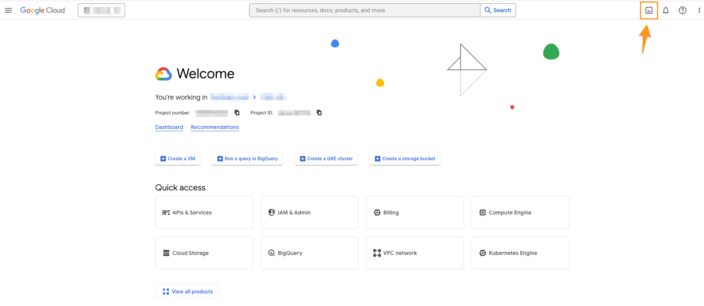
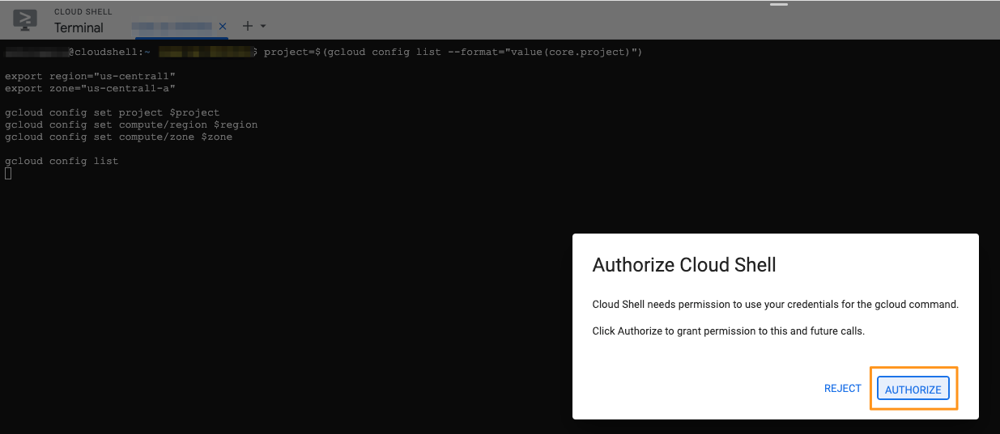
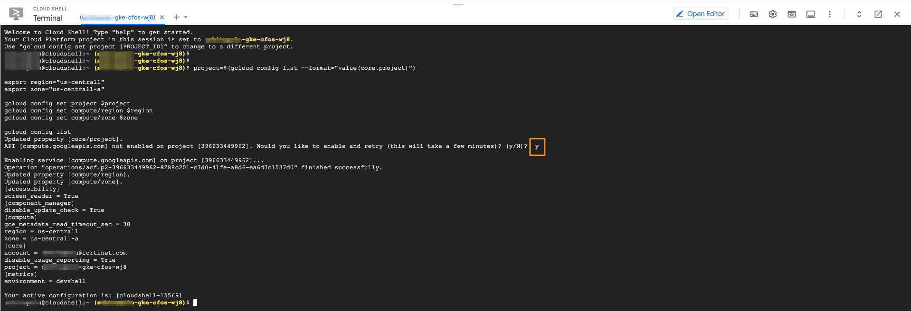
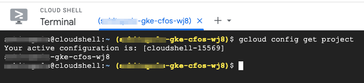
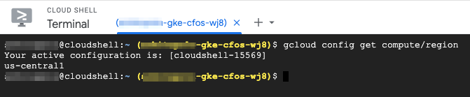
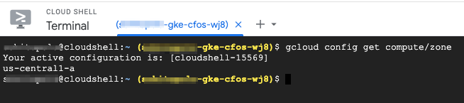

### Setup Google Cloud Shell

1. Activate Cloud Shell

    Click on the icon as shown below screenshot to activate the Cloud Shell, which should connect to the project.

    

2. Authorize Cloud Shell

    

3. Copy & Paste the below command to set up the environmental variables.

    ```
    project=$(gcloud config list --format="value(core.project)")

    export region="us-central1"
    export zone="us-central1-a"
    
    gcloud config set project $project
    gcloud config set compute/region $region
    gcloud config set compute/zone $zone
    
    gcloud config list
    ```

     Enable APIs if it prompts for.

    > output will be similar as below

    

4. Validate Project

    ```
    gcloud config get project
    ```
    
    > output will be similar as below

    

5. Validate Region

    ```
    gcloud config get compute/region
    ```
    
    > output will be similar as below

    

6. Validate Zone

    ```
    gcloud config get compute/zone
    ```
    
    > output will be similar as below

    
