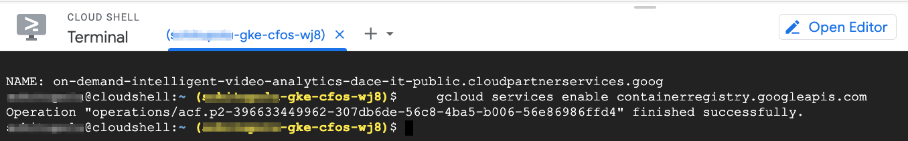
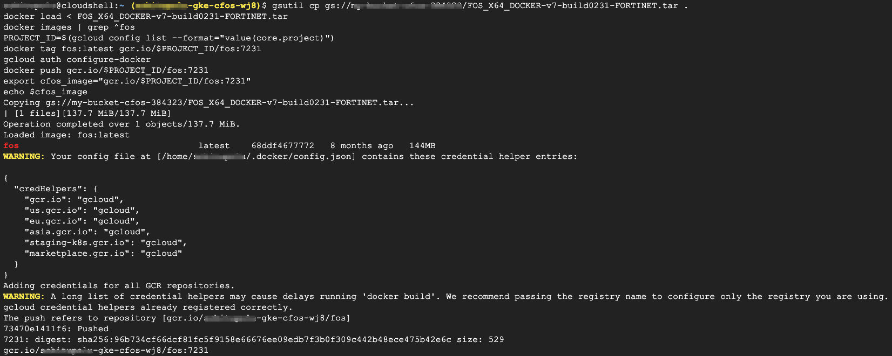
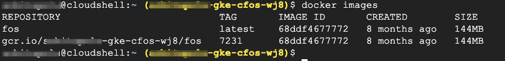

### Create Docker Image for cFOS in Google Container Registry

1. Enable Container Registry API

    ```
    gcloud services enable containerregistry.googleapis.com
    ```

    > output will be similar as below

    

2. Copy & Paste the below command to create Docker Image.

    ```
    project=$(gcloud config list --format="value(core.project)")
    gsutil cp gs://my-bucket-cfos-384323/FOS_X64_DOCKER-v7-build0231-FORTINET.tar .
    #gzip -d FOS_X64_DOCKER-v7-build0231-FORTINET.tar.gz
    docker load < FOS_X64_DOCKER-v7-build0231-FORTINET.tar
    docker images | grep ^fos
    PROJECT_ID=$(gcloud config list --format="value(core.project)")
    docker tag fos:latest gcr.io/$PROJECT_ID/fos:7231
    gcloud auth configure-docker
    docker push gcr.io/$PROJECT_ID/fos:7231
    export cfos_image="gcr.io/$PROJECT_ID/fos:7231"
    echo $cfos_image
    ```

    > output will be similar as below

    

3. Validate Docker Images

    ```
    docker images
    ```
    
    > output will be similar as below

    
