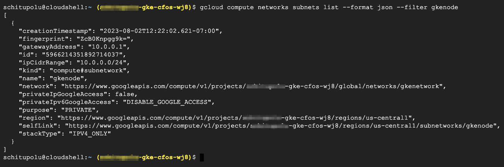
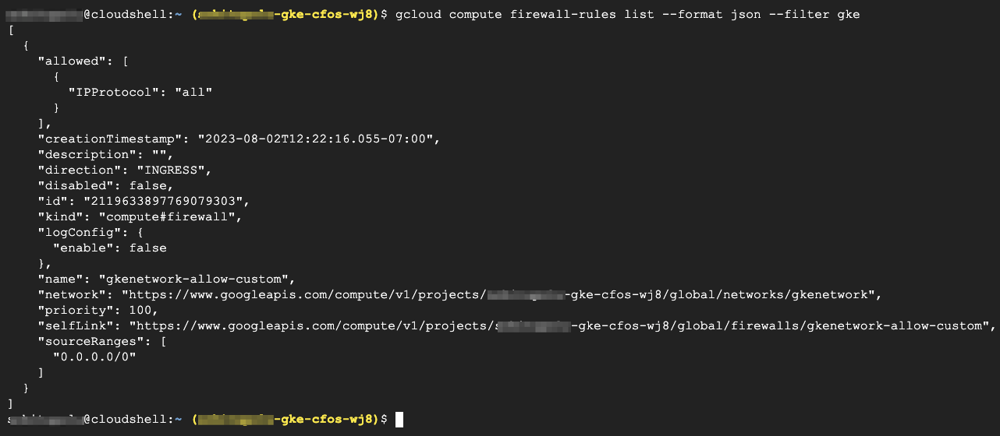

### Create & Validate VPC Network for GKE Cluster

1. Create VPC Network for GKE VM instances.

    - *ipcidrRange* is the ip range for VM node.

    - *firewallallowProtocol=all* will allow **ssh** into Worker node from anywhere to **all** protocols.

    > Below command will Create VPC Networks, Subnets and Firewall-rules

    ```
    gcloud compute networks create gkenetwork --subnet-mode custom --bgp-routing-mode  regional
    gcloud compute networks subnets create gkenode --network=gkenetwork --range=10.0.0.0/24
    gcloud compute firewall-rules create gkenetwork-allow-custom --network gkenetwork --allow all --direction ingress --priority  100
    ```

    > output will be similar as below

    

2. Validate VPC Network

    ```
    gcloud compute networks list --format json --filter gkenetwork
    ```
    
    > output will be similar as below

    

3. Validate Subnets

    ```
    gcloud compute networks subnets list --format json --filter gkenode
    ```
    
    > output will be similar as below

    

4. Validate Firewall Rules

    ```
    gcloud compute firewall-rules list --format json --filter gke
    ```
    
    > output will be similar as below

    