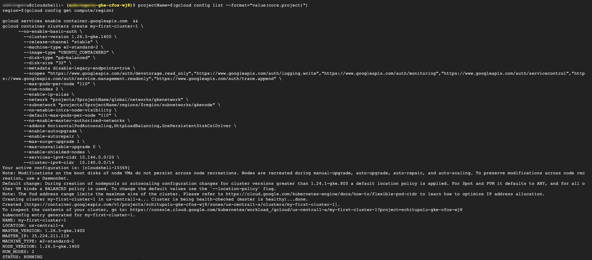

### Create GKE Cluster

> Below configuration attributes need to be set

   - *enable-ip-alias* will enable to use alias ip on VM for POD IP Address

   - *service-ipv4-cidr* is the CIDR for clusterVIP Address

   - *cluster-ipv4-cidr* is for POD IP Address scope

   - *kubectl get node -o wide* shall show whether the node is in ready state

> Below command will Create GKE Cluster 

```
projectName=$(gcloud config list --format="value(core.project)")
region=$(gcloud config get compute/region)

gcloud services enable container.googleapis.com  && 
gcloud container clusters create my-first-cluster-1 \
      --no-enable-basic-auth \
	--cluster-version 1.26.5-gke.1400 \
	--release-channel "stable" \
	--machine-type e2-standard-2 \
	--image-type "UBUNTU_CONTAINERD" \
	--disk-type "pd-balanced" \
	--disk-size "32" \
	--metadata disable-legacy-endpoints=true \
	--scopes "https://www.googleapis.com/auth/devstorage.read_only","https://www.googleapis.com/auth/logging.write","https://www.googleapis.com/auth/monitoring","https://www.googleapis.com/auth/servicecontrol","https://www.googleapis.com/auth/service.management.readonly","https://www.googleapis.com/auth/trace.append" \
	--max-pods-per-node "110" \
	--num-nodes 2 \
	--enable-ip-alias \
	--network "projects/$projectName/global/networks/gkenetwork" \
	--subnetwork "projects/$projectName/regions/$region/subnetworks/gkenode" \
	--no-enable-intra-node-visibility \
	--default-max-pods-per-node "110" \
	--no-enable-master-authorized-networks \
	--addons HorizontalPodAutoscaling,HttpLoadBalancing,GcePersistentDiskCsiDriver \
	--enable-autoupgrade \
	--enable-autorepair \
	--max-surge-upgrade 1 \
	--max-unavailable-upgrade 0 \
	--enable-shielded-nodes \
	--services-ipv4-cidr 10.144.0.0/20 \
	--cluster-ipv4-cidr  10.140.0.0/14
```

> output will be similar as below after completion



> Screenshot as in GUI


