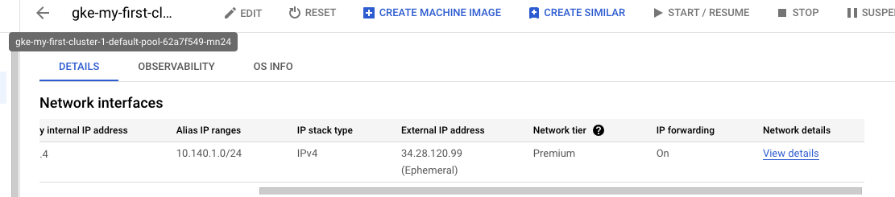
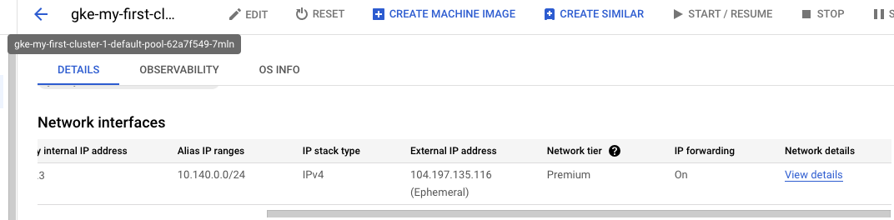

### Enable *ipforwarding* on Worker node

- By default, in GKE , *ipforwarding* is disabled. 

 
For **cFOS** to work, we have to enable *ipforwarding* on Worker node.<br>
For more detail, check <a href="https://github.com/GoogleCloudPlatform/guest-configs/blob/master/src/etc/sysctl.d/60-gce-network-security.conf" target="_blank">ipv4 forwarding config</a>.


- To enable *ipforwarding*, we need to config *canIpForward: true* for instance profile, for more detail , check  https://cloud.google.com/vpc/docs/using-routes#canipforward.

> Below command will enable ipforwarding

```
[[ $defaultClustername == "" ]] && defaultClustername="my-first-cluster-1"
gkeClusterName=$defaultClustername
clustersearchstring=$(gcloud container clusters list --filter=name=$gkeClusterName --format="value(name)" --limit=1)
node_list=$(gcloud compute instances list --filter="name~'$clustersearchstring'"  --format="value(name)" )
projectName=$(gcloud config list --format="value(core.project)")
zone=$(gcloud config list --format="value(compute.zone)" --limit=1)

for name in $node_list; do {
    gcloud compute instances export $name \
        --project $projectName \
        --zone $zone \
        --destination=./$name.txt
    grep -q "canIpForward: true" $name.txt || sed -i '/networkInterfaces/i canIpForward: true' $name.txt
    sed '/networkInterfaces/i canIpForward: true' $name.txt 
    gcloud compute instances update-from-file $name \
        --project $projectName \
        --zone $zone \
        --source=$name.txt \
        --most-disruptive-allowed-action=REFRESH
    echo "done for $name"
}
done
```

> output will be similar as below



