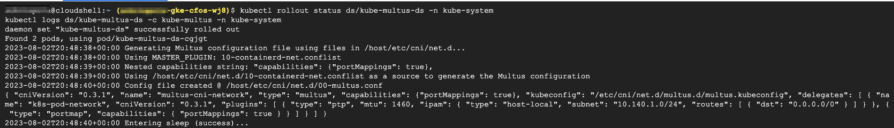

### Validate Multus CNI installation

```
kubectl rollout status ds/kube-multus-ds -n kube-system
kubectl logs ds/kube-multus-ds -c kube-multus -n kube-system
```


> output will be similar as below


