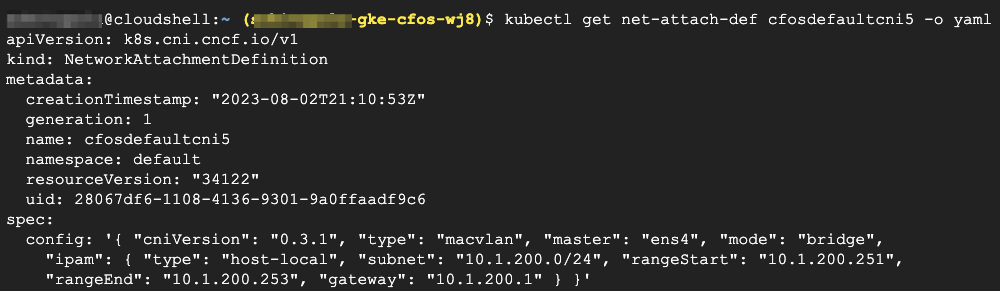

### Create & Validate net-attach-def for cFOS

1. We will create *net-attach-def* with **mac-vlan** CNI, Multus CNI will use this **net-attach-def** to create network and attach POD to the network.  
2. We use host-local as IPAM CNI. The **net-attach-def** is for cFOS to attach.  
3. The CNI config of **mac-vlan** use bridge mode and associate with *ens4* interface on Worker Node.  
4. If the Master interface on Worker Node is other than **ens4**, we need to change that to match the actual one on the Host Node.   
5. One can ssh into Worker Node to check Master interface name.  

The <strong>net-attach-def</strong> has name <strong>cfosdefaultcni5</strong>.

> Below command will create **net-attach-def**

```
cat << EOF | kubectl create -f  -
apiVersion: "k8s.cni.cncf.io/v1"
kind: NetworkAttachmentDefinition
metadata:
  name: cfosdefaultcni5
spec:
  config: '{
      "cniVersion": "0.3.1",
      "type": "macvlan",
      "master": "ens4",
      "mode": "bridge",
      "ipam": {
        "type": "host-local",
        "subnet": "10.1.200.0/24",
        "rangeStart": "10.1.200.251",
        "rangeEnd": "10.1.200.253",
        "gateway": "10.1.200.1"
      }
    }'
EOF

kubectl rollout status ds/kube-multus-ds -n kube-system  && echo "done"
kubectl get net-attach-def cfosdefaultcni5 -o yaml
```

> output will be similar as below


6. Validate **net-attach-def**

```
kubectl get net-attach-def cfosdefaultcni5 -o yaml 
```

> output will be similar as below

