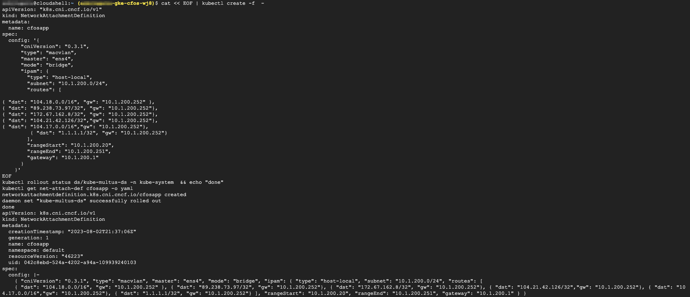
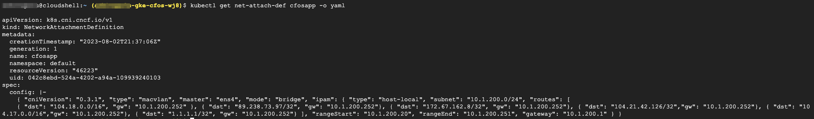

### Create & Validate net-attach-def for application

1. We will create **net-attach-def** with **mac-vlan** CNI, Multus CNI will use this **net-attach-def** to create Network and attach POD to the Network.  
2. We use host-local as IPAM CNI.  
3. The **net-attach-def** is for application to attach. 
4. The CNI config of **mac-vlan** use bridge mode and associated with *ens4* interface on Worker Node.  
5. If the master interface on Worker Node is other than *ens4*, then it needs to be changed.  
6. One can ssh into Worker Node to check Master interface name.  
7. The **net-attach-def** has name *cfosapp*.   
8. We also use *cfosapp* as label in policy manager demo.  


  If you change the name to something  else, you will also need to change the image for policy manager where *cfosapp* is hard coded in the image script.<br>
  In the nad config, we inserted specific custom route *{ "dst": "104.18.8.132/32", "gw": "10.1.200.252"},,{ "dst": "104.18.9.132/32", "gw": "10.1.200.252"},,{ "dst": "1.1.1.1/32", "gw": "10.1.200.252"}*, for traffic destinated to these subnets, the nexthop is cFOS interface ip.



> Below command will create **net-attach-def** for application

```
cat << EOF | kubectl create -f  -
apiVersion: "k8s.cni.cncf.io/v1"
kind: NetworkAttachmentDefinition
metadata:
  name: cfosapp
spec:
  config: '{
      "cniVersion": "0.3.1",
      "type": "macvlan",
      "master": "ens4",
      "mode": "bridge",
      "ipam": {
        "type": "host-local",
        "subnet": "10.1.200.0/24",
        "routes": [
         
{ "dst": "104.18.0.0/16", "gw": "10.1.200.252" },
{ "dst": "89.238.73.97/32", "gw": "10.1.200.252"},
{ "dst": "172.67.162.8/32", "gw": "10.1.200.252"},
{ "dst": "104.21.42.126/32","gw": "10.1.200.252"},
{ "dst": "104.17.0.0/16","gw": "10.1.200.252"},
         { "dst": "1.1.1.1/32", "gw": "10.1.200.252"}
        ],
        "rangeStart": "10.1.200.20",
        "rangeEnd": "10.1.200.251",
        "gateway": "10.1.200.1"
      }
    }'
EOF
kubectl rollout status ds/kube-multus-ds -n kube-system  && echo "done"
kubectl get net-attach-def cfosapp -o yaml
```

> output will be similar as below



9. Validate **net-attach-def** for application

```
kubectl get net-attach-def cfosapp -o yaml
```

> output will be similar as below


