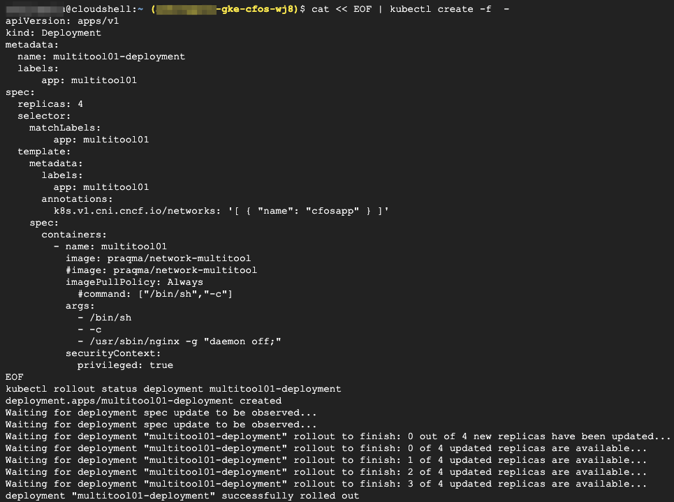

### Create Demo Application deployment

1. We use annotation *k8s.v1.cni.cncf.io/networks: '[ { "name": "cfosapp" } ]'* to config to POD for secondary interface and custom route entry.

2. We did not touch pod default route, instead we only insert custom route that we are interested. so for destination, the next hop will be cFOS. cFOS will inspect traffic for those traffic.

3. When POD attach to *cfosapp*, it will obtain *{ "dst": "104.18.8.132/32", "gw": "10.1.200.252"},, { "dst": "104.18.9.132/32", "gw": "10.1.200.252"},, { "dst": "1.1.1.1/32", "gw": "10.1.200.252"}*  route point to cFOS for inspection in this demo. 

> Below command will create application deployment

```
cat << EOF | kubectl create -f  -
apiVersion: apps/v1
kind: Deployment
metadata:
  name: multitool01-deployment
  labels:
      app: multitool01
spec:
  replicas: 4
  selector:
    matchLabels:
        app: multitool01
  template:
    metadata:
      labels:
        app: multitool01
      annotations:
        k8s.v1.cni.cncf.io/networks: '[ { "name": "cfosapp" } ]'
    spec:
      containers:
        - name: multitool01
          image: praqma/network-multitool
          #image: praqma/network-multitool
          imagePullPolicy: Always
            #command: ["/bin/sh","-c"]
          args:
            - /bin/sh
            - -c
            - /usr/sbin/nginx -g "daemon off;"
          securityContext:
            privileged: true
EOF
kubectl rollout status deployment multitool01-deployment
```

> output will be similar as below

