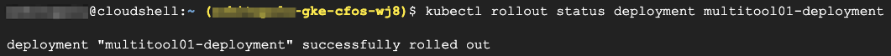
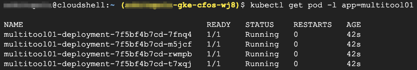
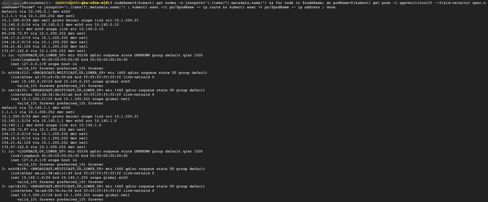

### Validate Demo Application deployment

Validate Demo Application deployment

```
kubectl rollout status deployment multitool01-deployment
```

> output will be similar as below



```
kubectl get pod -l app=multitool01
```

> output will be similar as below



```
nodeName=$(kubectl get nodes -o jsonpath='{.items[*].metadata.name}') && for node in $nodeName; do podName=$(kubectl get pods -l app=multitool01 --field-selector spec.nodeName="$node" -o jsonpath='{.items[*].metadata.name}') ; kubectl exec -it po/$podName -- ip route && kubectl exec -t po/$podName -- ip address ; done
```

> output will be similar as below


