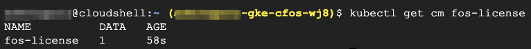

### Create and apply license for cFOS

1. Create cFOS license with FortiGate VM license and generate configmap for cFOS to fetch license. One can upload FortiGate VM license to gcloud shell via gcloud SHELL Terminal "upload" feature. 

2. Upload your FortiGate VM license to the directory where you run your script. 


3. export cfos_license_input_file="path_to_your_license" to setup the environment variable for license.

```
export cfos_license_input_file="path_to_your_license"
```

4. After exporting the variable, run below command which will apply the license

> Below command will create application deployment

```
[[ -z $cfos_license_input_file ]] && cfos_license_input_file="FGVMULTM23000044.lic"
[[ -f $cfos_license_input_file ]] ||  echo $cfos_license_input_file does not exist
mkdir -p $HOME/license
file="$HOME/license/cfos_license.yaml"
licensestring=$(sed '1d;$d' $cfos_license_input_file | tr -d '\n')
cat <<EOF >$file
apiVersion: v1
kind: ConfigMap
metadata:
    name: fos-license
    labels:
        app: fos
        category: license
data:
    license: |
     -----BEGIN FGT VM LICENSE-----
     $licensestring
     -----END FGT VM LICENSE-----
     
EOF

#file="$HOME/license/dockerpullsecret.yaml"
#[ -e $file ] && kubectl create -f $file || echo "$file  does not exist"
file="$HOME/license/cfos_license.yaml"
[ -e $file ] && kubectl create -f $file || echo "$file  does not exist"
```
> output will be similar as below


5. Validate License

```
kubectl get cm fos-license
```

> output will be similar as below

