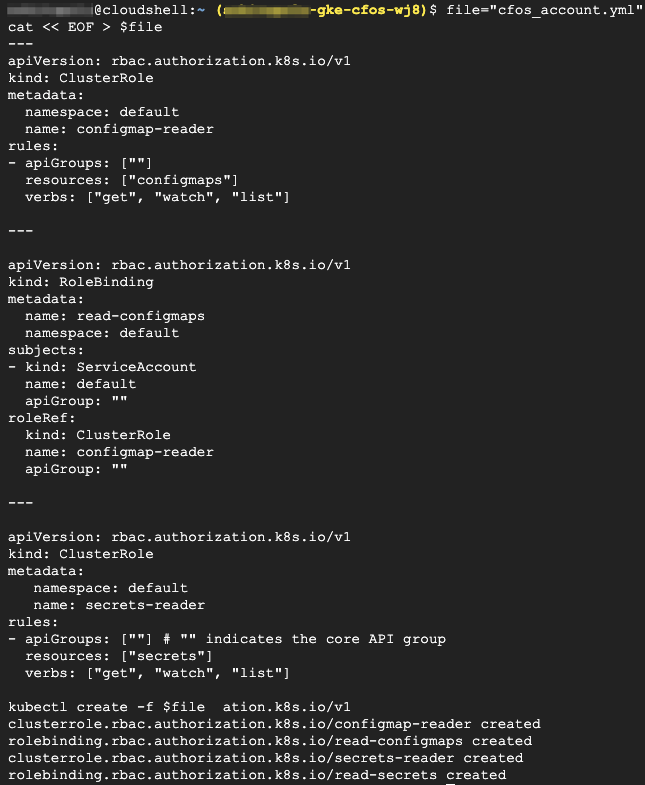
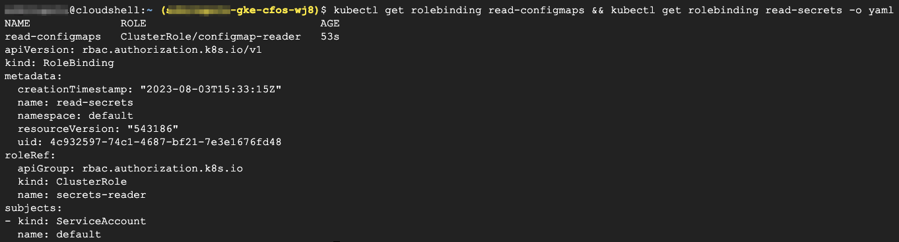

### Create & Validate Role and Service Account for cFOS

1. cFOS will require to read configmap permission to get license and also cFOS will require read-secrets permission to get secret to pull cFOS image.

> Below command will create cFOS Role and Service Account

```
file="cfos_account.yml" 
cat << EOF > $file
---
apiVersion: rbac.authorization.k8s.io/v1
kind: ClusterRole
metadata:
  namespace: default
  name: configmap-reader
rules:
- apiGroups: [""]
  resources: ["configmaps"]
  verbs: ["get", "watch", "list"]

---

apiVersion: rbac.authorization.k8s.io/v1
kind: RoleBinding
metadata:
  name: read-configmaps
  namespace: default
subjects:
- kind: ServiceAccount
  name: default
  apiGroup: ""
roleRef:
  kind: ClusterRole
  name: configmap-reader
  apiGroup: ""

---

apiVersion: rbac.authorization.k8s.io/v1
kind: ClusterRole
metadata:
   namespace: default
   name: secrets-reader
rules:
- apiGroups: [""] # "" indicates the core API group
  resources: ["secrets"]
  verbs: ["get", "watch", "list"]

---

apiVersion: rbac.authorization.k8s.io/v1
kind: RoleBinding
metadata:
  name: read-secrets
  namespace: default
subjects:
- kind: ServiceAccount
  name: default
  apiGroup: ""
roleRef:
  kind: ClusterRole
  name: secrets-reader
  apiGroup: ""
EOF

kubectl create -f $file1. 
```

> output will be similar as below



2. Validate output

```
kubectl get rolebinding read-configmaps && kubectl get rolebinding read-secrets -o yaml
```

> output will be similar as below

