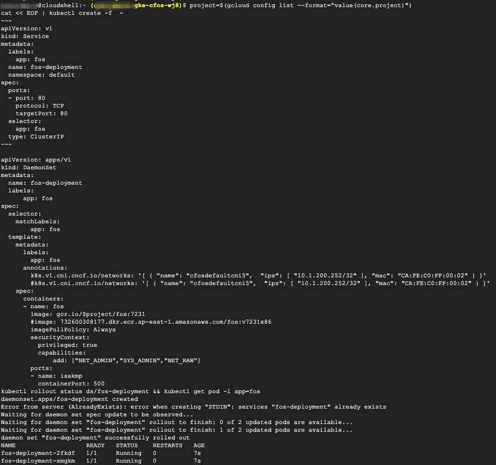

### Create & Validate cFOS DaemonSet

1. Create cFOS as DaemonSet, so each node will have single cFOS POD.

2. cFOS will be attached to net-attach-def CRD which was created earlier.

3. cFOS is configured as a ClusterIP service for restapi port.

4. cFOS will use annotation to attach to net-attach-def CRD cfosdefaultcni5.  
*k8s.v1.cni.cncf.io/networks* means secondary network.  
Default interface inside cFOS is net1.

5. cFOS will have fixed IP **10.1.200.252/32** which is the range of CRD cni configuration.  
cFOS can also have a fixed mac address.  
Linux capabilities like NET_ADMIN, SYS_AMDIN, NET_RAW are required for ping, sniff and syslog.

6. cFOS image will be pulled from Docker Hub with pull secret.

> Below command will Create cFOS DaemonSet

```
project=$(gcloud config list --format="value(core.project)")
cat << EOF | kubectl create -f  -
---
apiVersion: v1
kind: Service
metadata:
  labels:
    app: fos
  name: fos-deployment
  namespace: default
spec:
  ports:
  - port: 80
    protocol: TCP
    targetPort: 80
  selector:
    app: fos
  type: ClusterIP
---

apiVersion: apps/v1
kind: DaemonSet
metadata:
  name: fos-deployment
  labels:
      app: fos
spec:
  selector:
    matchLabels:
        app: fos
  template:
    metadata:
      labels:
        app: fos
      annotations:
        k8s.v1.cni.cncf.io/networks: '[ { "name": "cfosdefaultcni5",  "ips": [ "10.1.200.252/32" ], "mac": "CA:FE:C0:FF:00:02" } ]'
        #k8s.v1.cni.cncf.io/networks: '[ { "name": "cfosdefaultcni5",  "ips": [ "10.1.200.252/32" ], "mac": "CA:FE:C0:FF:00:02" } ]'
    spec:
      containers:
      - name: fos
        image: gcr.io/$project/fos:7231
        #image: 732600308177.dkr.ecr.ap-east-1.amazonaws.com/fos:v7231x86
        imagePullPolicy: Always
        securityContext:
          privileged: true
          capabilities:
              add: ["NET_ADMIN","SYS_ADMIN","NET_RAW"]
        ports:
        - name: isakmp
          containerPort: 500
          protocol: UDP
        - name: ipsec-nat-t
          containerPort: 4500
          protocol: UDP
        volumeMounts:
        - mountPath: /data
          name: data-volume
      imagePullSecrets:
      volumes:
      - name: data-volume
        #persistentVolumeClaim:
          #claimName: filestore-pvc
        hostPath:
          path: /home/kubernetes/cfosdata
          type: DirectoryOrCreate
EOF
kubectl rollout status ds/fos-deployment && kubectl get pod -l app=fos
```

> output will be similar as below



7. Validate output

```
kubectl rollout status ds/fos-deployment && kubectl get pod -l app=fos
```

> output will be similar as below


