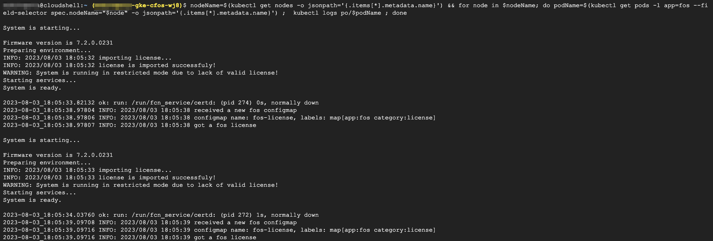

### Validate cFOS license

```
nodeName=$(kubectl get nodes -o jsonpath='{.items[*].metadata.name}') && for node in $nodeName; do podName=$(kubectl get pods -l app=fos --field-selector spec.nodeName="$node" -o jsonpath='{.items[*].metadata.name}') ;  kubectl logs po/$podName ; done
```

> output will be similar as below


