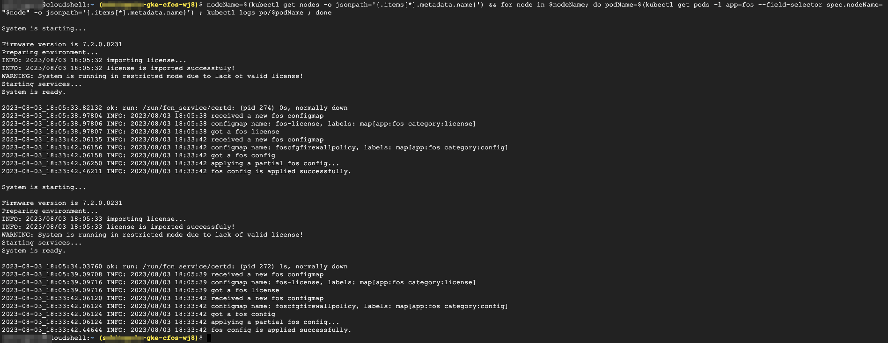

### Create configmap for cFOS to configure firewall policy

cFOS can be configured to use cFOS shell, kubernetes configmap and restApi. here we use configmap to config cFOS
there is an issue in this version, the configuration applied via configmap will not take effect until you restart cFOS DS.
the firewall policy has policy id set to 300 and source address set to any. once configmap created, cFOS will read the configmap and apply the policy. you can chech the log on cFOS to verify this.
delete configmap will not delete the policy on cFOS. you can also edit the policy in configmap use *kubectl edit cm foscfgfirewallpolicy* to update the policy.

1. Configmap for cFOS is utilized to configrue firewall policy.

 Currently, there is an issue with configmap while configuring cFOS, due to which, once configuration is applied via configmap, cFOS DS need to be restarted to take the configuration into effect.

2. Firewall policy has **policy id set to 300** and **source address set to any**. 

3. Once configmap is created, cFOS will read the configmap and apply the policy. One can check the logs on cFOS to validate. 

4. To update the policy, one can use configmap by **kubectl edit cm foscfgfirewallpolicy**.

 Delete configmap will not delete the policy on cFOS.

> Below command will create configmap that include firewall policy configuration

```
cat << EOF | kubectl create -f  -
apiVersion: v1
kind: ConfigMap
metadata:
  name: foscfgfirewallpolicy
  labels:
      app: fos
      category: config
data:
  type: partial
  config: |-
    config firewall policy
           edit "300"
               set utm-status enable
               set name "pod_to_internet_HTTPS_HTTP"
               set srcintf any
               set dstintf eth0
               set srcaddr all
               set dstaddr all
               set service HTTPS HTTP PING DNS
               set ssl-ssh-profile "deep-inspection"
               set ips-sensor "default"
               set webfilter-profile "default"
               set av-profile "default"
               set nat enable
               set logtraffic all
           next
       end
EOF
kubectl get cm foscfgfirewallpolicy -o yaml 
```

> output will be similar as below


5. Validate configmap for cFOS

```
kubectl get configmap foscfgfirewallpolicy -o yaml
```

> output will be similar as below


6. Check cFOS logs for retriving config from configmap

```
nodeName=$(kubectl get nodes -o jsonpath='{.items[*].metadata.name}') && for node in $nodeName; do podName=$(kubectl get pods -l app=fos --field-selector spec.nodeName="$node" -o jsonpath='{.items[*].metadata.name}') ; kubectl logs po/$podName ; done
```

> output will be similar as below

