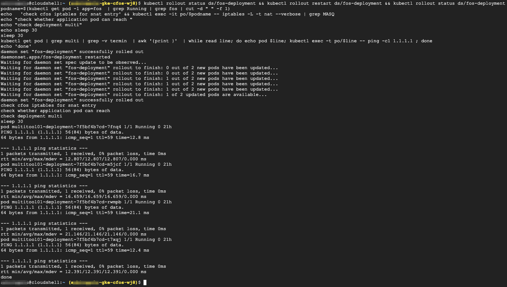
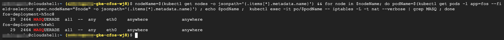

### Restart & Validate cFOS DaemonSet

 Currently, there is an issue with configmap while configuring cFOS, due to which, once configuration is applied via configmap, cFOS DS need to be restarted to take the configuration into effect.<br> Alternatively, one can shell into cFOS by executing *fcnsh*. Then remove config and add it back as a workaroud.


> Below command will restart cFOS DaemonSet

```
kubectl rollout status ds/fos-deployment && kubectl rollout restart ds/fos-deployment && kubectl rollout status ds/fos-deployment  
podname=$(kubectl get pod -l app=fos  | grep Running | grep fos | cut -d " " -f 1) 
echo   'check cfos iptables for snat entry' && kubectl exec -it po/$podname -- iptables -L -t nat --verbose | grep MASQ 
echo "check whether application pod can reach "
echo "check deployment multi"
echo sleep 30
sleep 30
kubectl get pod | grep multi | grep -v termin  | awk '{print }'  | while read line; do echo pod $line; kubectl exec -t po/$line -- ping -c1 1.1.1.1 ; done
echo 'done'
```

> output will be similar as below



#### Validate deployment status of cFOS after the restart

```
kubectl rollout status ds/fos-deployment
```

> output will be similar as below


#### Check Routing Table and IP Address

```
nodeName=$(kubectl get nodes -o jsonpath='{.items[*].metadata.name}') && for node in $nodeName; do podName=$(kubectl get pods -l app=fos --field-selector spec.nodeName="$node" -o jsonpath='{.items[*].metadata.name}') ; echo $podName ;  kubectl exec -it po/$podName -- iptables -L -t nat --verbose | grep MASQ ; done
```

> output will be similar as below

