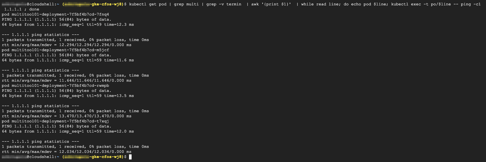

### Check ping result

```
kubectl get pod | grep multi | grep -v termin  | awk '{print $1}'  | while read line; do echo pod $line; kubectl exec -t po/$line -- ping -c1 1.1.1.1 ; done
```

> output will be similar as below


