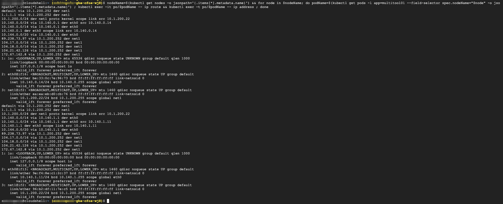

### Create application deployment

Create application deployment with annotation to use **net-attach-def** and make config *default-route* pointing to **net-attach-def** attached to interface, .i.e. cFOS interface.  

The annotation field has context **k8s.v1.cni.cncf.io/networks: '[ { "name": "cfosapp",  "default-route": ["10.1.200.252"]  } ]'**, with config having default-route nexthop to 10.1.200.252.  

Check IP route table on application, to see the default route pointing to cFOS interface.

> Below command to create application deployment

```
cat << EOF | kubectl create -f - 
apiVersion: apps/v1
kind: Deployment
metadata:
  name: multitool01-deployment
  labels:
      app: multitool01
spec:
  replicas: 4
  selector:
    matchLabels:
        app: multitool01
  template:
    metadata:
      labels:
        app: multitool01
      annotations:
        k8s.v1.cni.cncf.io/networks: '[ { "name": "cfosapp", "default-route": ["10.1.200.252"] } ]'
    spec:
      containers:
        - name: multitool01
          image: praqma/network-multitool
          #image: praqma/network-multitool
          imagePullPolicy: Always
            #command: ["/bin/sh","-c"]
          args:
            - /bin/sh
            - -c
            - /usr/sbin/nginx -g "daemon off;"
          securityContext:
            privileged: true
EOF

kubectl rollout status deployment multitool01-deployment
echo "sleep 30 seconds for it will take some time to trigger policymanager to update cfos addressgrp"
sleep 30
```

### Validate the result

```
nodeName=$(kubectl get nodes -o jsonpath='{.items[*].metadata.name}') && for node in $nodeName; do podName=$(kubectl get pods -l app=multitool01 --field-selector spec.nodeName="$node" -o jsonpath='{.items[*].metadata.name}') ; kubectl exec -it po/$podName -- ip route && kubectl exec -t po/$podName -- ip address ; done
```

> output will be similar as below

