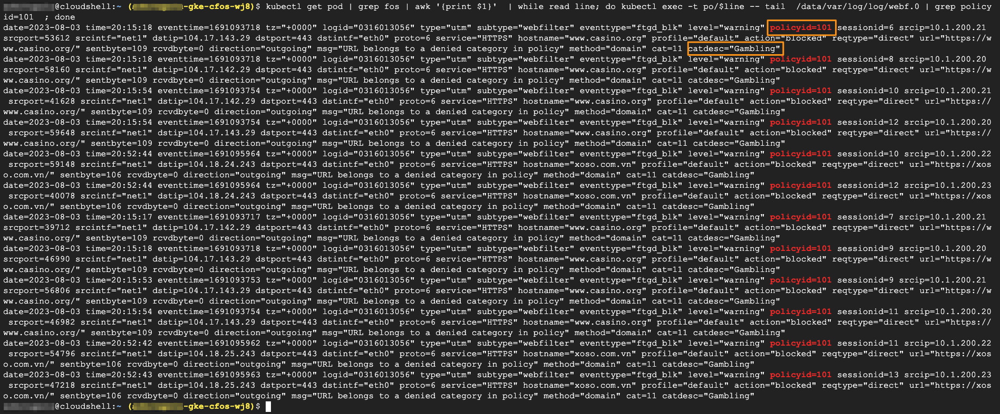

### Perform Web Filter test for 3rd time on a target website

For this test, we will use a destination that doesn't match the default route, for example https://xoso.com.vn. **cFOS** will classify this website as Gambling, and will be blocked by default profile.

> Below command will provide access to the target website 

```
kubectl get pod | grep multi | grep -v termin | awk '{print }'  | while read line; do kubectl exec -t po/$line --  curl -k -I  https://xoso.com.vn  ; done
```

### Validate the result

```
kubectl get pod | grep fos | awk '{print $1}'  | while read line; do kubectl exec -t po/$line -- tail  /data/var/log/log/webf.0 | grep policyid=101  ; done
```

> output will be similar as below

