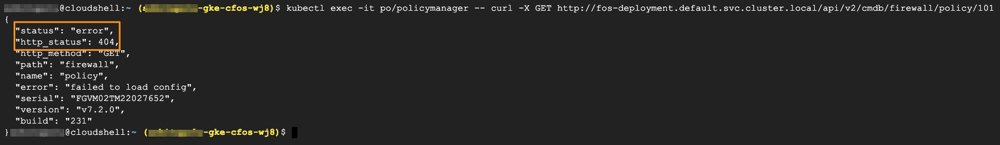

### cFOS REST API to delete firewall policy

We will delete the policy created by policy_manager POD with policy_id 101 using **cfos REST API**.  

After deleting the firewall policy, we will CURL to check whether any firewall policy exist on cFOS POD.

> Below command will delete firewall policy

```
nodeList=$(kubectl get pod -l app=fos -o jsonpath='{.items[*].status.podIP}')
for i in $nodeList; do {
kubectl exec -it po/policymanager -- curl -X DELETE "$i/api/v2/cmdb/firewall/policy/101"
}
done
```

### Validate the result

```
kubectl exec -it po/policymanager -- curl -X GET http://fos-deployment.default.svc.cluster.local/api/v2/cmdb/firewall/policy/101
```

> output will be similar as below

