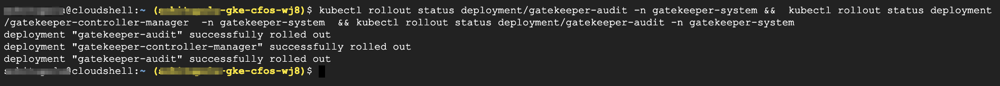

### Install gatekeeperv3

In this usecase, we will use standard **K8s networkpolicy** to create firewallpolicy for cFOS.  

The **networkpolicy** submitted by kubectl, will be sent to gatekeeper admission controller, where there is a constraint delpoyed to inspect the policy constraint via constraint template.  

If the networkpolicy pass the constrait check, the constraint template will use **cFOS Rest API** to create the firewall policy.

> Below command will install gatekeeper constraint template

```
kubectl apply -f https://raw.githubusercontent.com/open-policy-agent/gatekeeper/master/deploy/gatekeeper.yaml && \
kubectl rollout status deployment/gatekeeper-audit -n gatekeeper-system &&  \
kubectl rollout status deployment/gatekeeper-controller-manager  -n gatekeeper-system  && kubectl rollout status deployment/gatekeeper-audit -n gatekeeper-system
```

### Validate the result

```
kubectl rollout status deployment/gatekeeper-audit -n gatekeeper-system &&  kubectl rollout status deployment/gatekeeper-controller-manager  -n gatekeeper-system  && kubectl rollout status deployment/gatekeeper-audit -n gatekeeper-system
```

> output will be similar as below

