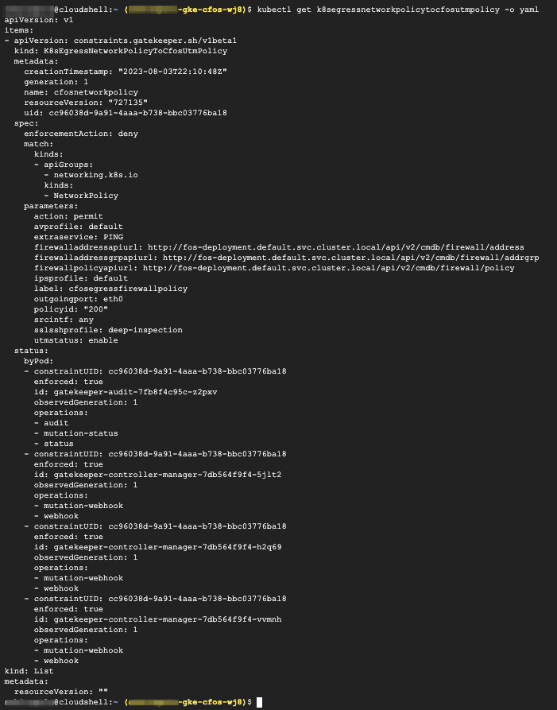

### Install policy constraint

The policy constraint is defined to watch respective API, for example, here we watch **NetworkPolicy API**. It also functions as parameter input to constraint template.  

For example, user passed in policy id=200 for constraint template, which we also pass in cFOS restAPI URL etc.

 We are using dns name of clusterIP for cFOS API.<br>If we are not using shared storage for cFOS /data folder, we need to run API call multiple times to make sure that the config is applied for each cFOS POD..

> Below command will install policy constraint template

```
cat << EOF | kubectl create -f - 
apiVersion: constraints.gatekeeper.sh/v1beta1
kind: K8sEgressNetworkPolicyToCfosUtmPolicy
metadata:
  name: cfosnetworkpolicy
spec:
  enforcementAction: deny
  match:
    kinds:
      - apiGroups: ["networking.k8s.io"]
        kinds: ["NetworkPolicy"]
  parameters:
    firewalladdressapiurl : "http://fos-deployment.default.svc.cluster.local/api/v2/cmdb/firewall/address"
    firewallpolicyapiurl : "http://fos-deployment.default.svc.cluster.local/api/v2/cmdb/firewall/policy"
    firewalladdressgrpapiurl: "http://fos-deployment.default.svc.cluster.local/api/v2/cmdb/firewall/addrgrp"
    policyid : "200"
    label: "cfosegressfirewallpolicy"
    outgoingport: "eth0"
    utmstatus: "enable"
    ipsprofile: "default"
    avprofile: "default"
    sslsshprofile: "deep-inspection"
    action: "permit"
    srcintf: "any"
    extraservice: "PING"
EOF
```

### Validate the result

```
kubectl get k8segressnetworkpolicytocfosutmpolicy -o yaml
```

> output will be similar as below

