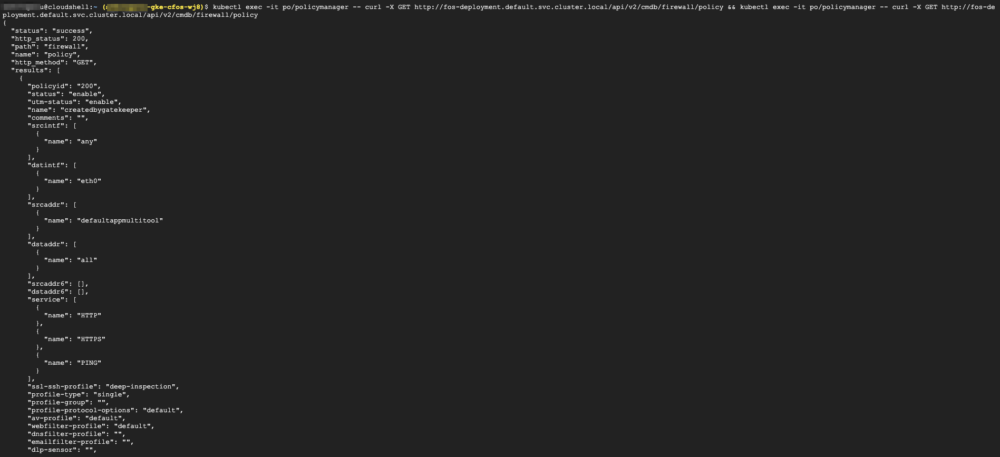

### Create standard NetworkPolicy

In here, we create standard K8s egress networkpolicy.  

This policy will be created on cFOS with the help of gatekeeper.  

 Once created, policy will not show up when executing the command **kubectl get networkpolicy** created on cFOS.<br>But, one can get the policy info by using the cFOS API with command "kubectl exec -it po/policymanager -- curl -X GET http://fos-deployment.default.svc.cluster.local/api/v2/cmdb/firewall/policy"


> Below command will deploy networkpolicy

```
[[ -z $cfos_label ]] && cfos_label="fos"
[[ -z $gatekeeper_policy_id ]] && gatekeeper_policy_id="200"
filename="49_network_firewallpolicy_egress.yml"
cat << EOF >$filename
apiVersion: networking.k8s.io/v1
kind: NetworkPolicy
metadata:
  name: createdbygatekeeper
  labels:
    app: cfosegressfirewallpolicy
spec:
  podSelector:
    matchLabels:
      app: multitool
      namespace: default
  egress:
  - to:
    - ipBlock:
        cidr: 0.0.0.0/0
    ports:
    - protocol: TCP
      port: 443
    - protocol: TCP
      port: 80
EOF

#node_list=$(kubectl get nodes -o=jsonpath='{range .items[*]}{.metadata.name}{"\n"}{end}')
node_list=$(kubectl get pod -l app=$cfos_label -o jsonpath='{.items[*].status.podIP}')

for node in $node_list;  do  {

while true ; do 
	kubectl apply -f $filename
	sleep 5
	number_of_cfos_pod_applied=$(kubectl exec -it po/policymanager -- curl -X GET "$node/api/v2/cmdb/firewall/policy/$gatekeeper_policy_id" | grep policyid | wc -l)
	echo number_of_cfos_pod_applied is $number_of_cfos_pod_applied
	if [ $number_of_cfos_pod_applied -eq 1 ]; then
          break
        fi
done
}

done
```

Ignore the Error from server (Forbidden) messages.

### Validate the result

```
kubectl exec -it po/policymanager -- curl -X GET http://fos-deployment.default.svc.cluster.local/api/v2/cmdb/firewall/policy && kubectl exec -it po/policymanager -- curl -X GET http://fos-deployment.default.svc.cluster.local/api/v2/cmdb/firewall/policy
```

> output will be similar as below

