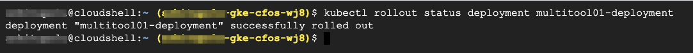

### Restart Application Deployment

Restart application deployment to trigger policymanager update addressgrp in **cFOS** due to limitation of policymanager, it require pod ip change to trigger update addressgrp in cFOS, we can restart application pod, scale in, scale out etc to force pod IP change. you can use "kubectl logs -f po/policymanager" to check the log of policymanager

> Below command will install gatekeeper

```
kubectl rollout restart deployment multitool01-deployment && kubectl rollout status deployment multitool01-deployment
echo "sleep 30 seconds for it will take some time to trigger policymanager to update cfos addressgrp"
sleep 30
```

### Check gatekeeper installation status

```
kubectl rollout status deployment multitool01-deployment
```

> output will be similar as below


