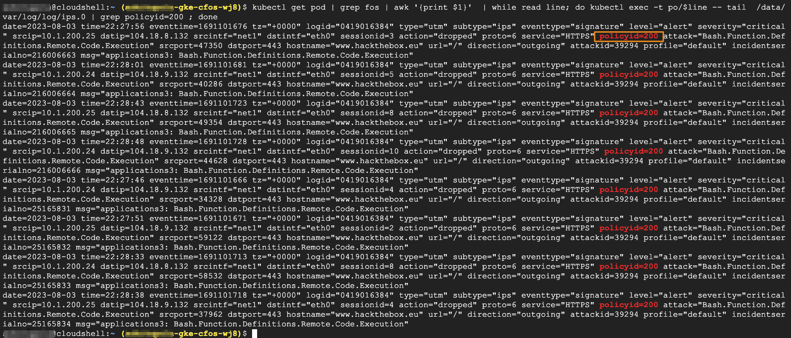

### Perform IPS test

Now, the policy created by **policymanager** will take the action.  

When we can check the IPS logs, it shows the traffic matching a different policy ID which is 200.

> Below command will send malicous traffic from application pod

```
kubectl get pod | grep multi | grep -v termin | awk '{print }'  | while read line; do kubectl exec -t po/$line -- dig www.hackthebox.eu ; done 
kubectl get pod | grep multi | grep -v termin | awk '{print }'  | while read line; do kubectl exec -t po/$line -- ping -c 2  www.hackthebox.eu ; done 
kubectl get pod | grep multi | grep -v termin | awk '{print }'  | while read line; do kubectl exec -t po/$line --  curl --max-time 5  -k -H "User-Agent: () { :; }; /bin/ls" https://www.hackthebox.eu ; done
```

### Validate the result

```
kubectl get pod | grep fos | awk '{print $1}'  | while read line; do kubectl exec -t po/$line -- tail  /data/var/log/log/ips.0 | grep policyid=200 ; done
```

> output will be similar as below

