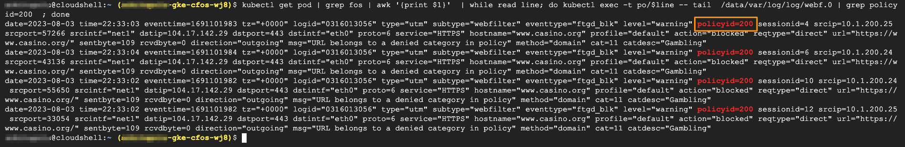

### Perform Web Filter test

> Below command will generate traffic to target website

```
kubectl get pod | grep multi | grep -v termin | awk '{print }'  | while read line; do kubectl exec -t po/$line --  curl -k -I  https://www.casino.org  ; done
```

### Check status

```
kubectl get pod | grep fos | awk '{print $1}'  | while read line; do kubectl exec -t po/$line -- tail  /data/var/log/log/webf.0 | grep policyid=200  ; done
```

> output will be similar as below

