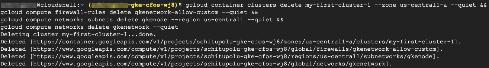

### Destroy GKE Cluster & Network

> Below command will Destroy the cluster

```
gcloud container clusters delete my-first-cluster-1 --zone us-central1-a --quiet && 
gcloud compute firewall-rules delete gkenetwork-allow-custom --quiet && 
gcloud compute networks subnets delete gkenode --region us-central1 --quiet &&
gcloud compute networks delete gkenetwork --quiet
```
> output will be similar as below


