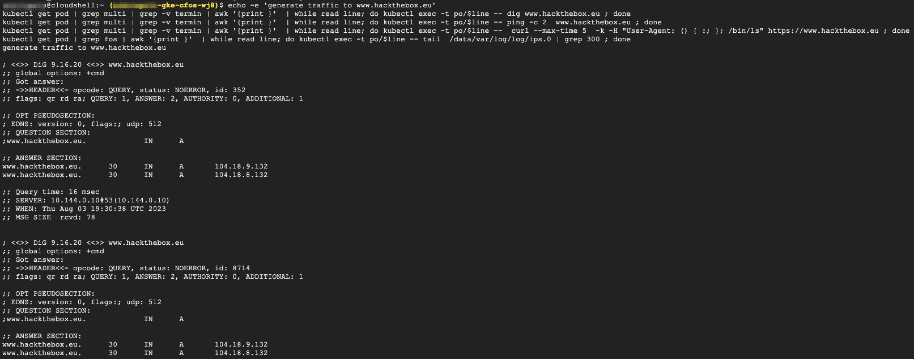

### Perform & Validate initial IPS test on a target website

It is very common that a malicious POD can geneate malicious traffic targeting external network or VM or physical machine.  
While the traffic is often encrypted, when traffic reaches **cFOS**, cFOS can decrpyt the traffic and look into the IPS signature.  
If the signature is matched, **cFOS** can either block it or pass it with alert depending on the policy configured.

In here, we will generate malicious traffic from application POD targeting a testing website.<br><strong>cFOS</strong> will block the traffic and log it.<br>One can expect to see IPS traffic logged with matched firewall policy id to indicate which policy is in action.

> Below command will send malicous traffic from application pod

```
echo -e 'generate traffic to www.hackthebox.eu' 
kubectl get pod | grep multi | grep -v termin | awk '{print }'  | while read line; do kubectl exec -t po/$line -- dig www.hackthebox.eu ; done 
kubectl get pod | grep multi | grep -v termin | awk '{print }'  | while read line; do kubectl exec -t po/$line -- ping -c 2  www.hackthebox.eu ; done 
kubectl get pod | grep multi | grep -v termin | awk '{print }'  | while read line; do kubectl exec -t po/$line --  curl --max-time 5  -k -H "User-Agent: () { :; }; /bin/ls" https://www.hackthebox.eu ; done
kubectl get pod | grep fos | awk '{print }'  | while read line; do kubectl exec -t po/$line -- tail  /data/var/log/log/ips.0 | grep 300 ; done
```

> output will be similar as below



### Validate the result

```
kubectl get pod | grep fos | awk '{print $1}'  | while read line; do kubectl exec -t po/$line -- tail  /data/var/log/log/ips.0 | grep 300  ; done
```

> output will be similar as below


