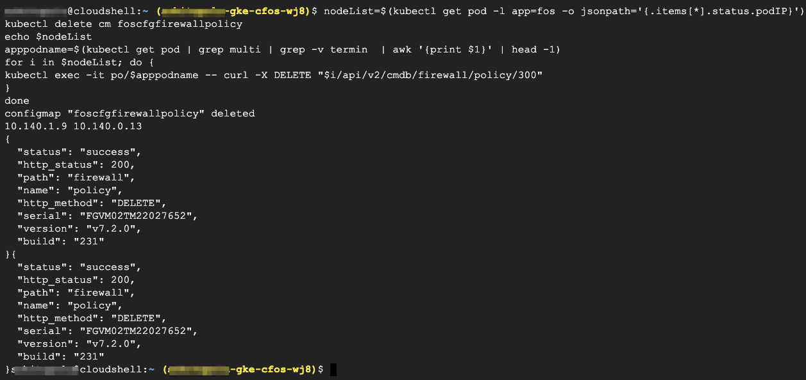
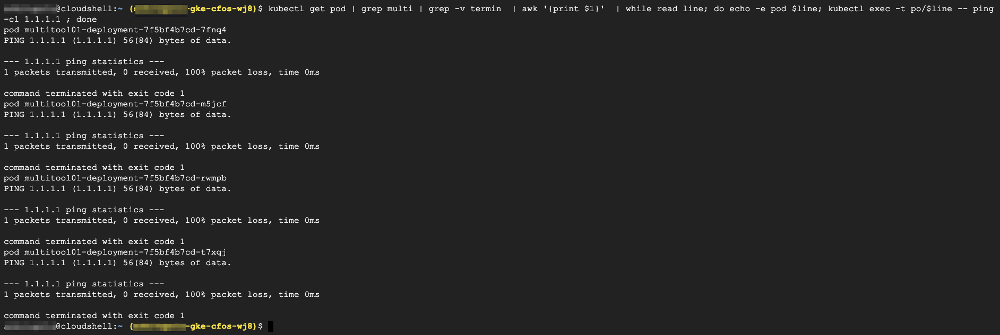

### Delete firewall policy using cFOS Rest API

One can use **cFOS** shell to change firewall policy or can also use **cFOS** restAPI for it.  
After deletion of firewall policy, ping 1.1.1.1 from application pod, which will no longer is reachable.

> Below command will delete firewall policy 

```
nodeList=$(kubectl get pod -l app=fos -o jsonpath='{.items[*].status.podIP}')
kubectl delete cm foscfgfirewallpolicy
echo $nodeList
apppodname=$(kubectl get pod | grep multi | grep -v termin  | awk '{print $1}' | head -1)
for i in $nodeList; do {
kubectl exec -it po/$apppodname -- curl -X DELETE "$i/api/v2/cmdb/firewall/policy/300"
}
done
```

> output will be similar as below



### Validate the result

```
kubectl get pod | grep multi | grep -v termin  | awk '{print $1}'  | while read line; do echo -e pod $line; kubectl exec -t po/$line -- ping -c1 1.1.1.1 ; done
```

> output will be similar as below

