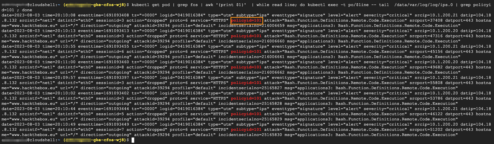

### Perform IPS test for 2nd time on a target website

We do IPS test again, this time, the policy is created by **policymanager** which will take into action.  

We can check the IPS logs for validation.  

The traffic will match with a different policy ID which is 101.


> Below command will send malicous traffic from application pod

```
echo -e "generate traffic to www.hackthebox.eu"
kubectl get pod | grep multi | grep -v termin | awk '{print }'  | while read line; do kubectl exec -t po/$line -- dig www.hackthebox.eu ; done 
kubectl get pod | grep multi | grep -v termin | awk '{print }'  | while read line; do kubectl exec -t po/$line -- ping -c 2  www.hackthebox.eu ; done 
kubectl get pod | grep multi | grep -v termin | awk '{print }'  | while read line; do kubectl exec -t po/$line --  curl --max-time 5  -k -H "User-Agent: () { :; }; /bin/ls" https://www.hackthebox.eu ; done
```

### Validate the result

```
kubectl get pod | grep fos | awk '{print $1}'  | while read line; do kubectl exec -t po/$line -- tail  /data/var/log/log/ips.0 | grep policyid=101 ; done
```

> output will be similar as below

