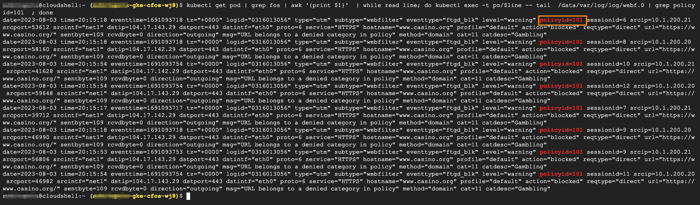

### Perform Web Filter test for 2nd time on a target website

We do Web Filter test again, this time, the policy is created by **policymanager** which will take into action.  

We can check the Web Filter logs for validation.  

The traffic will match with a different policy ID which is 101.

> Below command will generate traffic to target website

```
kubectl get pod | grep multi | grep -v termin | awk '{print }'  | while read line; do kubectl exec -t po/$line --  curl -k -I  https://www.casino.org  ; done
```

### Validate the result

```
kubectl get pod | grep fos | awk '{print $1}'  | while read line; do kubectl exec -t po/$line -- tail  /data/var/log/log/webf.0 | grep policyid=101  ; done
```

> output will be similar as below

