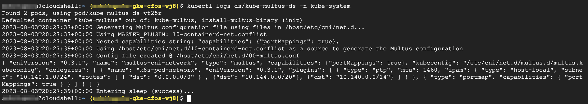

### Modify Worker Node default CNI Config

In previous sections, we did not touch application POD's default route. We were interested on the traffic whose destination is 1.1.1.1 which will send traffic to **cFOS**, while the rest of the traffic will continue to go to internet via default route.  

What about, if we want to send all traffic from application POD to **cFOS**?  

To accomplish it, we will need to insert a default route into application pod, for which, we will use annotation with keyword default-route to the POD definition. But this is not enough, one will also want some other traffic to go to default interface instead of going to **cFOS**.  

For example, the traffic goes to GKE cluster IP and cross POD to POD traffic.  

The GKE default CNI has host-local ipam, and inside host-local ipam, one can insert custom route.

In this usecase, we add ClusterIP CIDR range and POD IP CIDR range, and restart multus DaemonSet to update Multus default config.

> Below command will modify default GKE CNI config to insert route

```
set +H

clustersearchstring=$(gcloud container clusters list --format="value(name)" --limit=1) 
namelist=$(gcloud compute instances list --filter="name~$clustersearchstring"  --format="value(name)" ) 
for name in $namelist ; do {

route_exists=$(gcloud compute ssh $name --command="sudo grep -E '\"dst\": \"10.144.0.0\/20\"|\"dst\": \"10.140.0.0\/14\"' /etc/cni/net.d/10-containerd-net.conflist")

if [ -z "$route_exists" ]; then
  gcloud compute ssh $name --command="sudo sed -i '/\"dst\": \"0.0.0.0\/0\"/!b;n;N;s/        \]$/,\n          {\"dst\": \"10.144.0.0\/20\"},\n          {\"dst\": \"10.140.0.0\/14\"}\n        ]/' /etc/cni/net.d/10-containerd-net.conflist"
kubectl rollout restart ds/kube-multus-ds -n kube-system && 
kubectl rollout status ds/kube-multus-ds -n kube-system 
kubectl logs  ds/kube-multus-ds -n kube-system
fi
}
done
```

### Validate the result

```
kubectl logs ds/kube-multus-ds -n kube-system
```

> output will be similar as below

